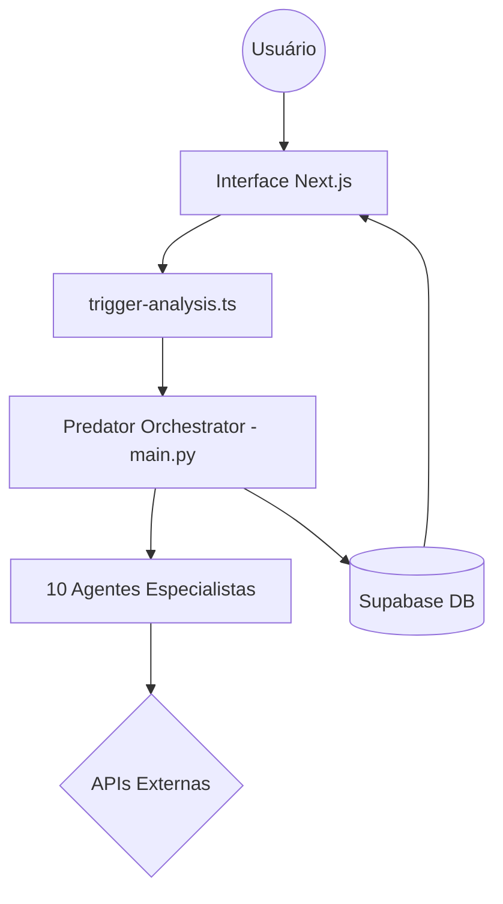
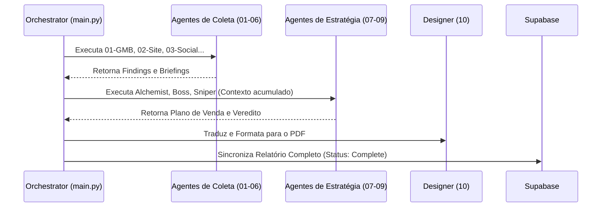

# GroowayOS: Arquitetura de Inteligência 360º

Este documento descreve a topologia técnica e o fluxo de dados do sistema de diagnóstico da Grooway.

## 1. Visão Geral do Sistema (Contexto)

O GroowayOS integra uma interface Next.js com um motor de inteligência multagente em Python, orquestrando auditorias técnicas e estratégicas em tempo real.

## 2. Fluxo de Execução de Agentes (Sequencial)

Atualmente, os agentes rodam um após o outro, com o "Boss" consolidando os briefings.

## 3. Ecossistema de Ferramentas (Hard Tools)

| Agente | Fonte de Dados Principal | Tecnologia/API |
| :--- | :--- | :--- |
| **01 Detectve GMB** | Google Maps | Apify / Google Places Crawler |
| **02 Perito Site** | Website URL | Google PageSpeed Insights / BeautifulSoup |
| **04 Espião Mercado** | Google Search | Apify / Google Search Scraper + Gemini |
| **05 Rastreador Leads** | Código-Fonte Site | Regex Patterns (Facebook Pixel, GTM, GA4) |
| **06 Maestro Ads** | Google Search (Live) | Apify / Google Search Scraper |
| **08 Senior Analyst** | Relatórios Anteriores | Gemini 1.5 Pro / Flash |

## 4. Decisões de Engenharia (Trade-offs)

1.  **Orquestração em Python:** Escolhida pela facilidade de integração com bibliotecas de IA e Raspagem.
2.  **Mapeamento de IDs:** Cada skill retorna um `id` fixo para que o frontend React saiba exatamente em qual aba exibir o dado.
3.  **Seguro Anti-Vácuo:** Implementado no `core.py` para garantir que instabilidades no Gemini ativem o fallback da OpenAI, evitando campos vazios.

---

> [!NOTE]
> Esta arquitetura está em transição para o modelo de **Paralelismo** para otimizar o tempo de espera.
