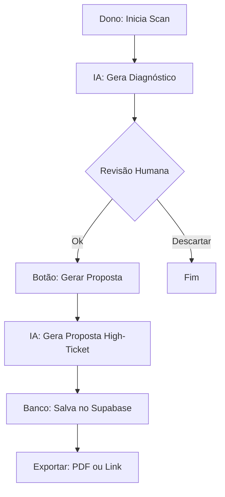

# Product Requirements Document (PRD) v1.0 - GroowayOS

**Projeto**: GroowayOS
**Título**: Fundação do Sistema Operacional da Agência
**Status**: Review
**Versão**: 1.0
**Author**: Antigravity (Genesis Engine)
**Date**: 2026-02-28

---

## 1. Executive Summary

O **GroowayOS** é o sistema operacional central da agência para gerir inteligência de vendas. Esta versão foca em consolidar as ferramentas de **Diagnóstico (Raio-X)** e **Proposta Premium** em uma arquitetura modular, permitindo a geração manual de propostas de alto valor e a persistência de dados no Supabase.

---

## 2. Background & Context

### 2.1 Problem Statement
- **Current Pain Point**: As ferramentas estão acopladas de forma desordenada (pastas umas dentro das outras), dificultando a manutenção, escalabilidade e a percepção de um sistema único.
- **Impact Scope**: Dono da agência e leads que recebem os relatórios.
- **Business Impact**: Lentidão no desenvolvimento de novas features e risco de quebra ao modificar componentes compartilhados.

### 2.2 Opportunity
Ao modularizar o sistema, ganhamos velocidade para adicionar novos agentes e ferramentas (como WhatsApp e CRM próprio), além de profissionalizar a entrega para o cliente final.

---

## 3. Goals & Non-Goals

### 3.1 Goals
- **[G1]**: Desacoplar os módulos de Diagnóstico e Proposta no código e na arquitetura.
- **[G2]**: Implementar fluxo manual (botão) para gerar propostas após a leitura do diagnóstico.
- **[G3]**: Garantir 100% de persistência das propostas geradas no Supabase.
- **[G4]**: Preparar a base de dados para suporte multi-usuário (colaboradores com níveis de acesso).

### 3.2 Non-Goals (Out of Scope)
- **[NG1]**: Automação total (gerar proposta sem clique humano).
- **[NG2]**: Integração nativa com CRMs externos nesta v1.
- **[NG3]**: Cadastro público de leads (auto-serviço). O sistema é de uso interno da agência.

---

## 4. User Stories (The "What")

### US01: Execução de Diagnóstico Estratégico [REQ-001]
*   **Story**: Como dono da agência, quero rodar um scan técnico de uma URL para que eu tenha insumos reais sobre as falhas do cliente.
*   **Acceptance Criteria (AC)**:
    *   [ ] **Given** URL e Nome da Empresa válidos, **When** clicar em "Iniciar Raio-X", **Then** os 10 agentes de IA devem processar os dados sequencialmente.
*   **Priority**: P0 (Must Have)

### US02: Geração Manual de Proposta Premium [REQ-002]
*   **Story**: Como dono da agência, quero revisar o diagnóstico e clicar em um botão para gerar a proposta premium apenas quando fizer sentido comercial.
*   **Acceptance Criteria (AC)**:
    *   [ ] **Given** um diagnóstico concluído, **When** clicar em "Gerar Proposta", **Then** a IA Alquimista deve criar o documento estratégico.
*   **Priority**: P0 (Must Have)

### US03: Persistência no Supabase [REQ-003]
*   **Story**: Como dono da agência, quero que as propostas fiquem salvas para que eu possa acessá-las ou reenviá-las depois.
*   **Acceptance Criteria (AC)**:
    *   [ ] **Given** uma proposta gerada, **When** o processo termina, **Then** o JSON completo deve ser persistido no Supabase associado à empresa.
*   **Priority**: P0 (Must Have)

### US04: Fundação para Colaboradores (RBAC) [REQ-004]
*   **Story**: Como dono da agência, quero que o sistema esteja pronto para receber colaboradores com acesso limitado no futuro.
*   **Acceptance Criteria (AC)**:
    *   [ ] **Given** a estrutura de banco de dados, **When** criarmos as tabelas, **Then** deve haver campos para `owner_id` e permissões de acesso.
*   **Priority**: P1 (Should Have)

---

## 5. User Experience & Design

### 5.1 Key User Flows

### 5.2 Design Guidelines
- **UI Style**: Dark Mode Premium, Glassmorphism, Identidade Visual GroowayOS.
- **Tone of Voice**: Consultivo, autoridade, focado em vendas de alto ticket.

---

## 6. Constraint Analysis

### 6.1 Technical Constraints
*   **Legacy**: Deve manter compatibilidade com os agentes Python existentes.
*   **Performance**: O scan completo não deve estourar o timeout da Vercel (uso de background jobs ou streaming).

### 6.2 Security & Compliance
*   **Privacy**: Propostas e dados de leads não devem ser públicos sem token de acesso.

---

## 7. Success Metrics

| Metric | Target | Measurement Method |
|--------|--------|-------------------|
| Tempo de Geração de Proposta | < 30s | Monitoramento Server Action |
| Taxa de Sucesso de Persistência | 100% | Logs do Supabase |

---

## 8. Definition of Done (DoD)

*   [ ] Arquitetura modular documentada e aprovada.
*   [ ] Código desacoplado em pastas `features/xray` e `features/proposals`.
*   [ ] Integração com Supabase funcional para salvamento de propostas.
*   [ ] Interface de usuário seguindo o padrão Premium.

---

## 9. Appendix

### 9.1 Glossary
- **Raio-X**: O diagnóstico técnico detalhado.
- **Alquimista**: O agente de IA responsável pela Proposta de Valor.
- **Boss**: O agente que audita e dá o veredito final.
