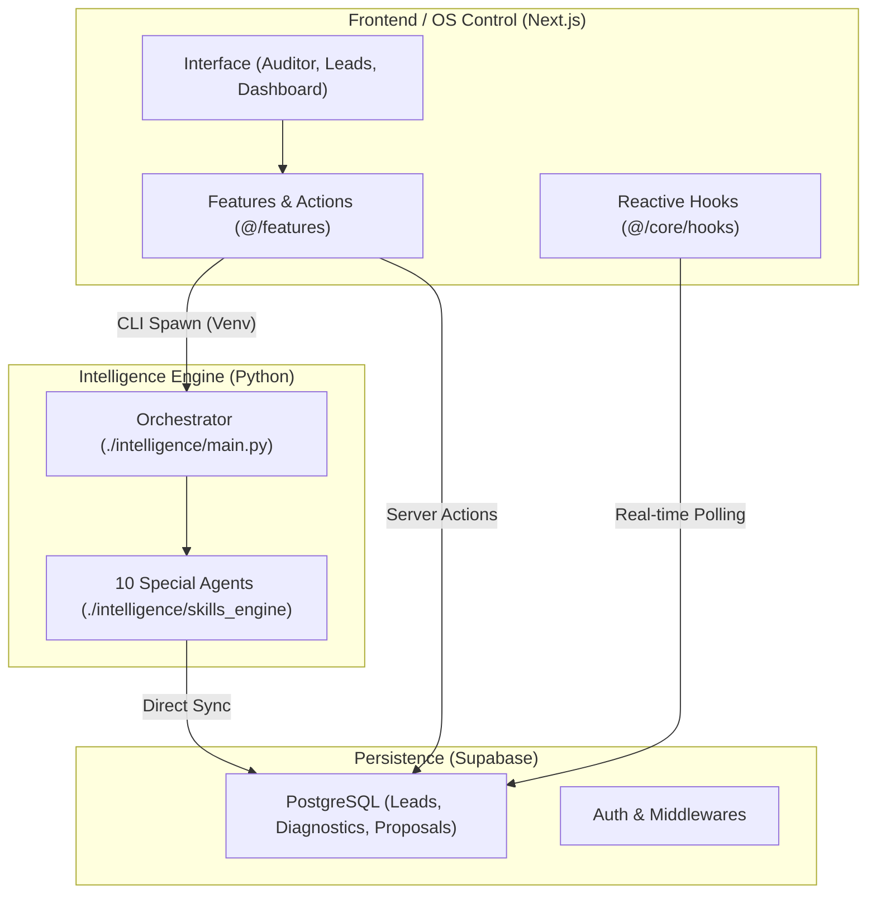

# GroowayOS Unified Architecture 🏗️

This document maps the centralized industrial structure of the GroowayOS after the **Industrial Cleanup**.

## 1. System Overview
The system is now a single, cohesive industrial engine where the frontend directly orchestrates the background intelligence agents.

## 2. Component Blueprint

### A. Control Center (`/src/app`)
- **(os)**: Internal operating system routes (Auditor, Leads, Dashboard).
- **(public)**: Standalone URLs for client sharing (Report, Proposal).
- **auth/login**: Secure entry points.

### B. Intelligence Engine (`/intelligence`)
- **main.py**: The brain that parses JSON input and runs specialized skills.
- **skills_engine/**: Modular repository of the 10 intelligence specialists.
- **venv/**: Dedicated Python environment.

### C. Feature Modules (`/src/features`)
- **xray/**: Diagnostic logic and Python triggers.
- **proposals/**: Sales asset generation and refinement.

## 3. Data Flow Pattern
1. **Trigger**: Frontend creates a pending diagnostic and spawns Python via CLI.
2. **Analysis**: Python runs technical scans (GMB, SEO, Performance) in background.
3. **Sync**: Python updates Supabase directly using `service_role`.
4. **Resolution**: Frontend polls the DB and displays results as they arrive.

---
**Status**: ESTRUTURA UNIFICADA E DOCUMENTADA.
