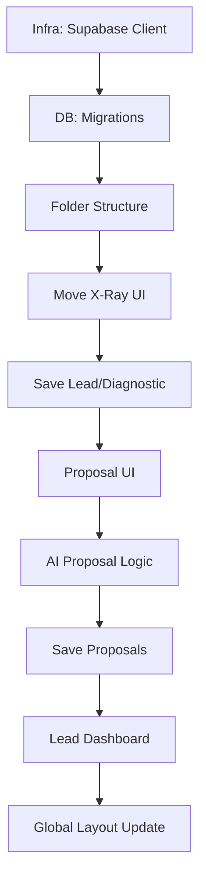

# 05_TASKS - Blueprint do GroowayOS v1

## 📊 Macro Mapeamento (Sprint Roadmap)

| Sprint | Codinome | Meta Central | Critério de Saída (Done) | Tempo (Est.) |
|--------|------|---------|---------|------|
| S1 | Fundação | Infra e Banco de Dados | Tabelas Supabase prontas e estrutura de pastas criada | 6-8h |
| S2 | Modularização | Desacoplar Raio-X | Raio-X funcional dentro de `features/xray` salvando no DB | 10-12h |
| S3 | Alquimia | Módulo de Propostas | Geração manual de propostas funcionando e persistindo | 12-16h |
| S4 | Maestria | OS Core e dashboard | Dashboard de leads funcional com UI Premium | 8-10h |

---

## 🕸️ Teia de Dependências (Dependency Graph)

---

## 🧩 Decomposição de Tarefas (WBS)

### Sprint 1: Fundação 🏗️

- [x] **T1.1** [REQ-003]: Configuração do Client Supabase
  - **Descrição**: Configurar o cliente oficial do Supabase no Next.js usando variáveis de ambiente.
  - **Input**: Credenciais do Supabase no `.env.local`
  - **Output**: Arquivo `src/core/lib/supabase.ts` exportando o cliente.
  - **Critérios de Aceite**: 
    - Dado variáveis de ambiente configuradas
    - Quando o app carregar
    - Então o cliente Supabase deve estar inicializado sem erros.
  - **Instruções de Verificação**: Rodar `npm run dev` e verificar logs do sistema.
  - **Tempo Estimado (Horas)**: 2h

- [x] **T1.2** [REQ-001, REQ-004]: Migração do Banco de Dados
  - **Descrição**: Criar as tabelas `leads`, `diagnostics`, `proposals` e `profiles` diretamente no Supabase.
  - **Input**: SQL definido em `genesis/v1/04_SYSTEM_DESIGN/01_DATABASE_SCHEMA.md`
  - **Output**: Tabelas criadas no Supabase.
  - **Critérios de Aceite**: 
    - Dado o script SQL
    - Quando executado no editor do Supabase
    - Então as 4 tabelas devem ser criadas com as constraints e JSONB.
  - **Instruções de Verificação**: Verificar presença das tabelas na UI do Supabase dashboard.
  - **Tempo Estimado (Horas)**: 3h

- [x] **T1.3** [REQ-001]: Criação da Árvore Física
  - **Descrição**: Criar o esqueleto das pastas de features.
  - **Input**: Mapa de pastas em `02_ARCHITECTURE_OVERVIEW.md`
  - **Output**: Diretórios `src/features/xray`, `src/features/proposals`, `src/core` criados.
  - **Critérios de Aceite**: 
    - Dado o comando de criação
    - Quando terminal for executado
    - Então as pastas devem existir.
  - **Instruções de Verificação**: `ls -R src/`
  - **Tempo Estimado (Horas)**: 1h

- [x] **INT-S1** [MILESTONE]: Integração da Fundação
  - **Descrição**: Validar que a infra base está pronta para receber o código modularizado.
  - **Dependência**: T1.1, T1.2, T1.3
  - **Tempo Estimado (Horas)**: 2h

### Sprint 2: Modularização (Raio-X) 🔍

- [ ] **T2.1** [REQ-001]: Mover UI do Raio-X
  - **Descrição**: Refatorar o código atual do auditor para dentro de `src/features/xray`.
  - **Input**: Código atual em `src/app/(os)/auditor/`
  - **Output**: Componentes desacoplados em `src/features/xray/components/`.
  - **Critérios de Aceite**: 
    - Dado o código antigo
    - Quando movido e imports atualizados
    - Então a tela de diagnóstico deve carregar sem erros.
  - **Instruções de Verificação**: Abrir a URL local do auditor e testar renderização.
  - **Tempo Estimado (Horas)**: 6h

- [ ] **T2.2** [REQ-003]: Implementar Persistência do Diagnóstico
  - **Descrição**: Adicionar lógica para salvar o `predator_report.json` no Supabase após o scan técnico.
  - **Input**: Output JSON do Python Agent.
  - **Output**: Registro nas tabelas `leads` e `diagnostics`.
  - **Critérios de Aceite**: 
    - Dado um scan finalizado
    - Quando o resultado chegar no Next.js
    - Então os dados devem aparecer na tabela `diagnostics` do Supabase.
  - **Instruções de Verificação**: Verificar novas linhas no banco após rodar um scan real.
  - **Tempo Estimado (Horas)**: 4h

- [ ] **INT-S2** [MILESTONE]: Integração X-Ray Modular
  - **Descrição**: Validar que o scan técnico funciona 100% no novo formato.
  - **Dependência**: T2.1, T2.2
  - **Tempo Estimado (Horas)**: 2h

### Sprint 3: Alquimia (Propostas) 💎

- [ ] **T3.1** [REQ-002]: Interface de Visualização da Proposta
  - **Descrição**: Criar a UI Premium para exibir a Proposta Premium (baseado no modal de valor atual).
  - **Input**: Design system do GroowayOS.
  - **Output**: Nova página/modal em `src/features/proposals/components/ProposalViewer.tsx`.
  - **Critérios de Aceite**: 
    - Dado um objeto JSON de proposta
    - Quando renderizado
    - Então deve exibir design com autoridade e elegância.
  - **Instruções de Verificação**: Verificar visualmente com dados fake.
  - **Tempo Estimado (Horas)**: 6h

- [ ] **T3.2** [REQ-002]: Gatilho de IA para Geração Manual
  - **Descrição**: Implementar o botão "Gerar Proposta" que envia o diagnóstico para o Agent Python "Alquimista".
  - **Input**: ID do diagnóstico no Supabase.
  - **Output**: JSON da proposta persuasiva.
  - **Critérios de Aceite**: 
    - Dado um diagnóstico pronto
    - Quando clicar no botão
    - Então deve chamar o agent Python e devolver o texto da proposta.
  - **Instruções de Verificação**: Testar fluxo completo do clique ao retorno da IA.
  - **Tempo Estimado (Horas)**: 6h

- [ ] **T3.3** [REQ-003]: Persistência de Propostas
  - **Descrição**: Salvar o conteúdo da proposta na tabela `proposals`.
  - **Input**: JSON retornado pelo T3.2.
  - **Output**: Registro salvo na tabela `proposals`.
  - **Critérios de Aceite**: 
    - Dado uma proposta gerada
    - Quando finalizada a geração
    - Então deve ser salva automaticamente como 'draft'.
  - **Instruções de Verificação**: Verificar tabela `proposals` no Supabase.
  - **Tempo Estimado (Horas)**: 4h

- [ ] **INT-S3** [MILESTONE]: Integração Módulo Propostas
  - **Descrição**: Ciclo completo de Diagnóstico -> Geração de Proposta -> Banco de Dados.
  - **Dependência**: T3.1, T3.2, T3.3
  - **Tempo Estimado (Horas)**: 4h

### Sprint 4: Maestria (OS Core) 👑

- [ ] **T4.1** [REQ-001, 003]: Dashboard de Leads
  - **Descrição**: Criar lista central de empresas analisadas (o início do CRM).
  - **Input**: Dados da tabela `leads`.
  - **Output**: Página `/dashboard` ou `/leads` listando empresas e status.
  - **Critérios de Aceite**: 
    - Dado leads salvos
    - Quando acessar a tela
    - Então deve listar as empresas com links para seus respectivos diagnósticos e propostas.
  - **Instruções de Verificação**: Testar navegação entre leads.
  - **Tempo Estimado (Horas)**: 6h

- [ ] **T4.2** [REQ-001]: Layout Global e Navegação
  - **Descrição**: Unificar Sidebar e Navbar para alternar entre Raio-X e Leads.
  - **Input**: `src/core/layouts/`.
  - **Output**: Sistema de navegação lateral funcional.
  - **Critérios de Aceite**: 
    - Dado o app aberto
    - Quando clicar na sidebar
    - Então deve trocar de contexto sem recarregar o app inteiro.
  - **Instruções de Verificação**: Teste de navegação.
  - **Tempo Estimado (Horas)**: 4h

- [ ] **INT-S4** [MILESTONE]: GroowayOS v1 Completo
  - **Descrição**: Auditoria final de todos os canais e fluxo fim-a-fim.
  - **Dependência**: Todas as anteriores.
  - **Tempo Estimado (Horas)**: 4h
