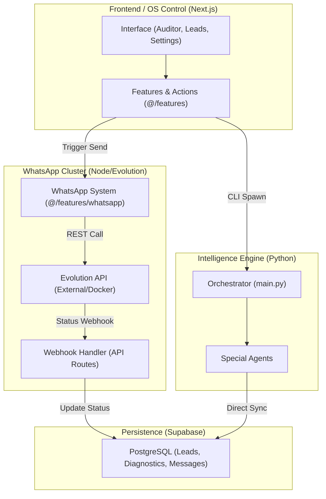

# GroowayOS Unified Architecture v2.0 🏗️🚀

This document maps the evolved industrial structure of the GroowayOS, now including the **WhatsApp Automation Module (Wave 5)**.

## 1. System Overview
The OS is expanding into active engagement. The system now includes a messaging cluster that orchestrates outbound communication and inbound status tracking.

## 2. Component Blueprint

### A. WhatsApp Automation System (`@/features/whatsapp`)
- **Action Triggers**: Functions to send text, PDFs (Prospectus), and Links (Diagnostic).
- **Instance Manager**: Logic to handle QR Code generation and session heartbeat.
- **Queue Manager**: Rate-limiting logic to prevent account flagging.

### B. Communication Webhooks (`/src/app/api/webhooks/whatsapp`)
- **Receiver**: Endpoint that listens to Evolution API events.
- **State Syncer**: Updates `messages` table in Supabase (sent -> delivered -> read).

## 3. Data Flow Pattern (WhatsApp)
1. **Request**: UI triggers "Send via WA".
2. **Dispatch**: Feature module calls Evolution API REST endpoint.
3. **Tracking**: Evolution API sends webhook back to GroowayOS on status change.
4. **CRM Sync**: OS updates the relevant Lead record with the new interaction status.

---
**Status**: ARQUITETURA V2.0 DEFINIDA. ✅
